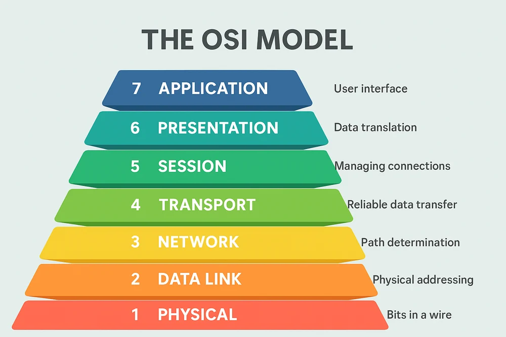
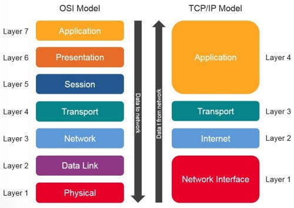

_This project has been created as part of the 42 curriculum by marberge._

   
    
   

# 42-NetPractice

    
    
     
    
    
    
    
    

# Description

NetPractice is a practical, hands-on project designed to introduce the core concepts of computer networking. Through a series of 10 interactive, simulated levels, the project focuses on configuring small-scale networks to ensure proper communication between devices. 

The main objective is to apply theoretical knowledge to solve real-world network issues, such as routing loops, unreachable hosts, and isolated subnets. This involves calculating and assigning correct IP addresses, defining precise subnet masks, and properly configuring routing tables and default gateways to interconnect local environments with the broader Internet.

# Instructions

1) Download the file attached to the project's page on the intranet:

    	net_practice.1.9.tgz

2) Extract the files into the folder of your choice (example with the standard archive name):

    	tar -xvzf net_practice.1.9.tgz -C <Your_Directory>

3) Run the training interface

	Navigate to your directory and run the run.sh script to launch the local web server and automatically open the interface in your browser:

    	./run.sh

	Note: Due to technical design and security constraints on various web browsers, it is required to use a local web server to deliver NetPractice’s web pages. If the “run.sh” script does not function properly, you can access the project manually:

    	python3 -m http.server 49242

	You may change the port number. Then, in your web browser navigate to the URL :

    	http://localhost:49242

	(or any other port you may have chosen).

4) Export configurations

	For each of the 10 available levels, it is possible to download the correct network configuration (.json file).

	Once a level is successfully completed, click the [Get my config] button to download the configuration file.

5) Submission requirements

	The 10 exported configuration .json files (one per level) are placed at the root of the Git repository (e.g : level1.json).

# Resources

### TCP/IP Addressing
TCP/IP (Transmission Control Protocol/Internet Protocol) addressing is the fundamental system used to identify devices on a network. In IPv4, an IP address consists of 32 bits, typically represented as four decimal numbers separated by dots (e.g., `192.168.1.10`). An IP address serves two primary purposes: it identifies the specific host (the machine) and the network to which that host belongs.

### Subnet Masks
A subnet mask is a 32-bit number used in combination with an IP address to divide the address into two parts: the network identifier and the host identifier. It determines the size of the network. For example, a `255.255.255.0` mask (or `/24` in CIDR notation) indicates that the first 24 bits represent the network, leaving 8 bits for the hosts (allowing up to 254 usable addresses). Subnetting allows for the efficient division of large network blocks into smaller, isolated sub-networks.

### Default Gateways
A default gateway is the node (usually a router interface) that serves as an access point or "exit door" to another network. When a machine needs to send a packet to an IP address that is not located within its own local subnet, it forwards the packet to its default gateway. The gateway's routing table then takes over to forward the packet toward its final destination (such as the Internet).

### Routers and Switches
*   **Switch:** A switch operates within a single local area network (LAN). It acts as a central hub for devices and forwards data frames based on their MAC (physical) addresses. Unlike older hubs, a switch ensures that each connected machine only receives the data explicitly addressed to it.
*   **Router:** A router is designed to connect multiple, fundamentally different networks together (such as connecting a LAN to the Internet). It directs data packets across these networks using IP addresses and routing tables, preventing broadcast traffic from crossing between separate networks.

### OSI Layers

### OSI and TCP/IP Models
The **OSI (Open Systems Interconnection) model** is a theoretical 7-layer framework used to understand and standardize how different network systems communicate, from the physical hardware up to the software application. The **TCP/IP model** is its practical, 4-layer counterpart and the actual protocol suite that powers the modern Internet. While the OSI model serves as the universal standard for learning and troubleshooting network architecture, the TCP/IP model represents how data routing is actively implemented in the real world.

   
    
   

   
    
   

### AI Usage
Artificial Intelligence (Gemini) was utilized as a pedagogical tutor during the learning phase of this project. Specifically, AI was used as a thought partner to break down the mathematical logic behind binary subnet masking, to explain the concept of CIDR notation and route summarization, and to review and refine the English phrasing within this README file. No AI was used to generate the final network configuration solutions, which were solved manually.